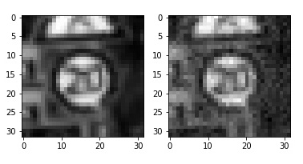
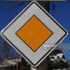
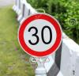
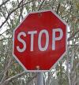

## Project: Build a Traffic Sign Recognition Program
[](http://www.udacity.com/drive)

# **Traffic Sign Recognition** 

## Writeup


---

**Build a Traffic Sign Recognition Project**

The goals / steps of this project are the following:
* Load the data set
* Explore, summarize and visualize the data set
* Design, train and test a model architecture
* Use the model to make predictions on new images
* Analyze the softmax probabilities of the new images
* Summarize the results with a written report


[//]: # (Image References)





---

### Data Set Summary & Exploration

#### 1. Provide a basic summary of the data set. In the code, the analysis should be done using python, numpy and/or pandas methods rather than hardcoding results manually.

I used the pandas library to calculate summary statistics of the traffic
signs data set:

```python
### Replace each question mark with the appropriate value. 
### Use python, pandas or numpy methods rather than hard coding the results


import numpy as np

# Number of training examples
n_train = np.shape(X_train)[0]

# Number of validation examples
n_validation = np.shape(X_valid)[0]

# Number of testing examples.
n_test = np.shape(X_test)[0]

# What's the shape of an traffic sign image?
image_shape = np.shape(X_train[0])

# How many unique classes/labels there are in the dataset.
n_classes = len(np.unique(y_train))

print("Number of training examples =", n_train)
print("Number of validation examples =", n_validation)
print("Number of testing examples =", n_test)
print("Image data shape =", image_shape)
print("Number of classes =", n_classes)
```

    Number of training examples = 34799
    Number of validation examples = 4410
    Number of testing examples = 12630
    Image data shape = (32, 32, 3)
    Number of classes = 43


### Design and Test a Model Architecture

#### 1. Describe how you preprocessed the image data. What techniques were chosen and why did you choose these techniques? Consider including images showing the output of each preprocessing technique. Pre-processing refers to techniques such as converting to grayscale, normalization, etc. (OPTIONAL: As described in the "Stand Out Suggestions" part of the rubric, if you generated additional data for training, describe why you decided to generate additional data, how you generated the data, and provide example images of the additional data. Then describe the characteristics of the augmented training set like number of images in the set, number of images for each class, etc.)

*Pre-process the Data Set (normalization, grayscale, and so forth)* subsection.

There are some transformations required to be performed on each image to feed it to the neural network.
1. Normalize RGB image. It is done to make each image "look similar" to each other, to make input consistent.
2. Convert RGB image to grayscale. It was observed that neural network performs slightly better on the grayscale images.
It also may be wrong observations.

I shuffled the data as a part of preprocessing so that data order does not matters to CNN. First, I tried without normalizing the data and then with normalizing the data. Validation accuracy increased by around 1%. I've not converted the image to grayscale. Only, I've normalized it.


#### 2. Describe what your final model architecture looks like including model type, layers, layer sizes, connectivity, etc.) Consider including a diagram and/or table describing the final model.

My final model consisted of the following layers:

| Layer            | Description                                                 |
|------------------|-------------------------------------------------------------|
| Input            | 32x32x3 RGB image                                           |
| Convolution      | 5x5 filter with 1x1 stride, valid padding, outputs 28x28x6  |
| RELU             |                                                             |
| Convolution      | 5x5 filter with 2x2 stride, valid padding, outputs 14x14x10 |
| RELU             |                                                             |
| Convolution      | 5x5 filter with 1x1 stride, valid padding, outputs 8x8x16   |
| RELU             |                                                             |
| Max Pooling      | 2x2 ksize with 2x2 stride, valid padding, outputs 4x4x16    |
| Flatten          | outputs 256                                                 |
| Fully Connected  | Input 256 and outputs 120                                   |
| RELU             |                                                             |
| Dropout          | keep_prob=0.5                                               |
| Fully Connected  | Inputs 120 and outputs 100                                  |
| RELU             |                                                             |
| Fully Connected  | Inputs 100 and outputs 84                                   |
| RELU             |                                                             |
| Fully Connected  | Inputs 84 and outputs 43                                    |
|                  |                                                           
 


#### 3. Describe how you trained your model. The discussion can include the type of optimizer, the batch size, number of epochs and any hyperparameters such as learning rate.
The model is using Adam optimizer to minimize loss function. It worked better than stochastic gradient descent. 
The following hyperparameters were defined and **carefully** adjusted:
I trained my model using the following hyperparameters-

###### number of training epochs; here the model stops improving; we do not want it to overfit
* Epochs - 30

###### size of the batch of images per one train operation; surprisingly with larger batch sizes neural network reached lower performance
* Batch Size - 128

###### learning rate; with 0.001, 0.0007 and 0.0008 the performance is worse
* Learning Rate - 0.0009

* Optimizer- AdamOptimizer

* mu - 0

* sigma - 0.1

* dropout keep probability - 0.5

I traines my model with 10 epochs, my model underfitted, then I did with 50 epochs and my model overfitted. At last I chose 30 epochs.

#### 4. Describe the approach taken for finding a solution and getting the validation set accuracy to be at least 0.93. Include in the discussion the results on the training, validation and test sets and where in the code these were calculated. Your approach may have been an iterative process, in which case, outline the steps you took to get to the final solution and why you chose those steps. Perhaps your solution involved an already well known implementation or architecture. In this case, discuss why you think the architecture is suitable for the current problem.

My final model results were:
* validation set accuracy of 96.5% 
* test set accuracy of 95.3%

If an iterative approach was chosen:
* First I implemented the model same as lENET but got accuracy upto 90%
* then I added one more convulation layer and fully connected layer, set epochs to 30 and reduced learning rate.

 

### Test a Model on New Images

#### 1. Choose five German traffic signs found on the web and provide them in the report. For each image, discuss what quality or qualities might be difficult to classify.

The third image, "right of way at the next intersection", might be difficult to classify because it has a picture 
in the middle that is not very visible at the resolution 32x32. 
The second last image "Speed-limit-30-km" may be difficult to classify because it contains text in the middle with a specific speed limit. 
There are a lot of categories in the "speed limit" super-category. 
At the 32x32 resolution and low brightness or contrast, they are hardly distinguishable.

#### Performance on New Images

The performance of the predictions was 80%. However, when the similar model was
trained with 50 epochs, there was a mistake with "speed limit 30 km/h" traffic sign, the model was overfitted.
There may be mistakes on other types of images. With other models, I had a problem with "end of all speed and passing limits"
traffic sign classification. Also, the results on the test set were not perfect (95.3%), so, certainly, there are images
somewhere on the web that this model will not be able to recognize.

Here are five German traffic signs that I found on the web:








#### 2. Discuss the model's predictions on these new traffic signs and compare the results to predicting on the test set. At a minimum, discuss what the predictions were, the accuracy on these new predictions, and compare the accuracy to the accuracy on the test set (OPTIONAL: Discuss the results in more detail as described in the "Stand Out Suggestions" part of the rubric).

Here are the results of the prediction:

|                  PREDICTED                  |                   ACTUAL                    |
|:-------------------------------------------:|:-------------------------------------------:|
| 1            Speed limit (30km/h)           | 1            Speed limit (30km/h)           |
| 12              Priority road               | 12              Priority road               |
| 11  Right-of-way at the next intersection   | 27                Pedestrian                |
| 14                   Stop                   | 14                   Stop                   |
| 15               No vehicles                | 15               No vehicles                |


The model was able to correctly guess 4 of the 5 traffic signs, which gives an accuracy of 80%. 

#### 3. Describe how certain the model is when predicting on each of the five new images by looking at the softmax probabilities for each prediction. Provide the top 5 softmax probabilities for each image along with the sign type of each probability. (OPTIONAL: as described in the "Stand Out Suggestions" part of the rubric, visualizations can also be provided such as bar charts)
*Top 5 Softmax Probabilities For Each Image Found on the Web* subsection.

The model was quite certain about the four images. It was also pretty certain about "no vehicles" traffic signal,
but not totally. Below are top 5 softmax probabilities for "**no vehicles**" traffic sign.

| Probability           |     Prediction                                | 
|:---------------------:|:---------------------------------------------:| 
| 0.756710649           | No vehicles                                   | 
| 0.122047313           | Speed limit (30km/h)                          |
| 0.0512931943          | Priority road                                 |
| 0.0313977301          | Stop                                          |
| 0.0146821784          | No passing                                    |
